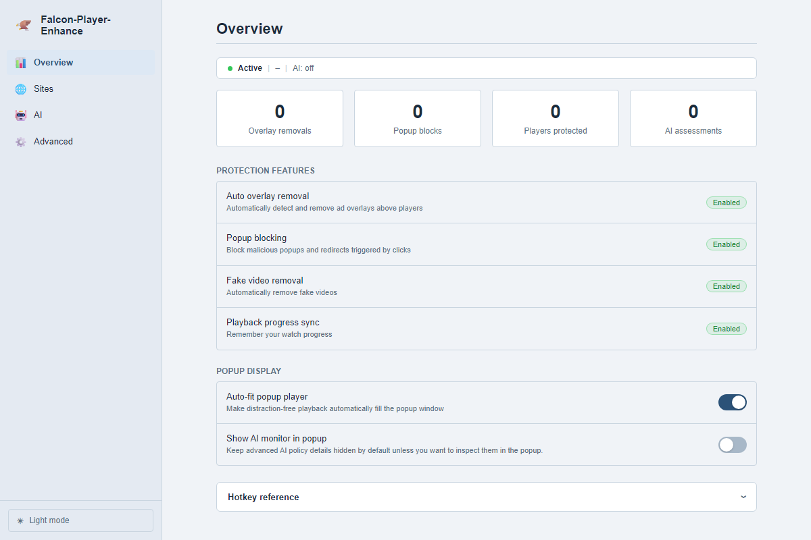

# 安裝與使用指南

## 安裝步驟

1. 開啟 `chrome://extensions/`
2. 啟用右上角的「開發人員模式」
3. 點擊「載入未封裝項目」
4. 選擇 `Falcon-Player-Enhance/extension`
5. 確認工具列已出現 Falcon-Player-Enhance 圖示


## 首次檢查

| 項目 | 預期結果 |
|------|----------|
| 擴充功能主開關 | 預設為開啟 |
| 封鎖等級 | 預設為 `L2 Standard` |
| 側邊欄 / Popup | 左鍵開啟側邊欄，右鍵可開啟 popup 視窗 |
| Dashboard 語系 | 可切換 `Auto / 繁體中文 / English` |

## 主要介面

### Popup

- 顯示三步驟流程：`CLICK → DETECT → PLAY`
- 顯示四張統計卡：`Overlays / Popups / Fake videos / Protected`
- 可直接調整封鎖等級、啟用元素封鎖、將目前網站升級為增強保護

### Dashboard



| 分頁 | 功能 |
|------|------|
| `Overview` | 保護狀態、統計卡、Popup 顯示設定、快捷鍵參考 |
| `Sites` | 白名單、黑名單、增強站點、比對範圍預覽 |
| `AI` | Provider、API key、模式、候選規則、健康檢查 |
| `Advanced` | Runtime policy gate、高風險站點、Sandbox、Blocked elements |

## AI Provider 設定

| Provider | 用途 | 需要設定 |
|----------|------|----------|
| `OpenAI` | 雲端模型分析 | API key |
| `Gemini` | Google AI 分析 | API key |
| `LM Studio` | 本機模型 | 本機 endpoint |
| `Gateway` | 自訂代理服務 | endpoint，必要時加 API key |

預設 LM Studio endpoint:

```text
http://127.0.0.1:1234/v1/chat/completions
```

## 疑難排解

### 擴充功能無法載入

1. 確認已啟用開發人員模式
2. 確認 `extension/manifest.json` 存在
3. 檢查 Chrome 擴充功能頁的錯誤訊息

### Popup 沒有偵測到播放器

1. 重新整理頁面
2. 再按一次 `DETECT`
3. 等待動態播放器載入完成後再測試

### AI provider 無法連線

1. 到 Dashboard 的 `AI` 分頁
2. 檢查 API key 或 endpoint
3. 使用 `Health check` 確認服務狀態

## 隱私與資料

- 所有保護邏輯預設在本地執行
- AI provider 僅在你啟用後才會被使用
- 統計、站點清單、候選規則與 AI 狀態都保存在瀏覽器本機儲存

## 延伸文件

| 文件 | 說明 |
|------|------|
| `README.zh-TW.md` | 專案總覽與截圖 |
| `docs/FEATURE_GUIDE.zh-TW.md` | 完整功能導覽 |
| `docs/PROGRESS_SNAPSHOT.zh-TW.md` | 最新開發進度 |
