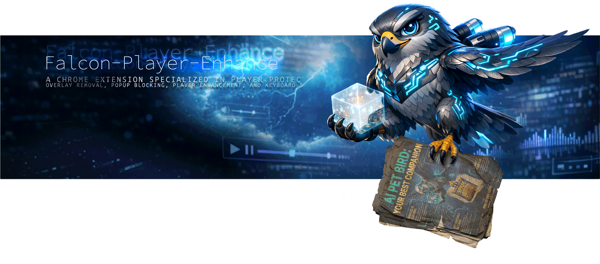
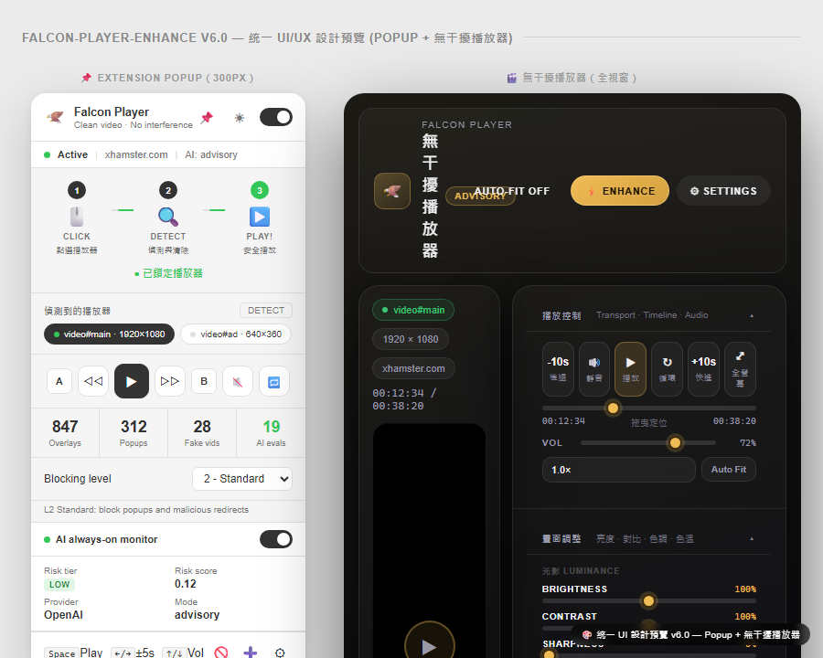
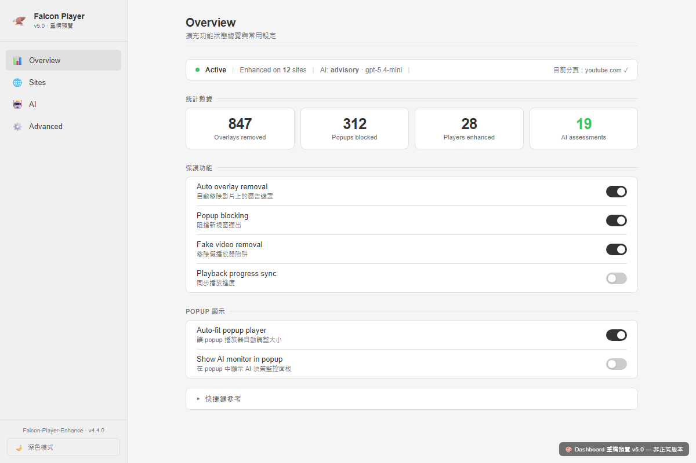
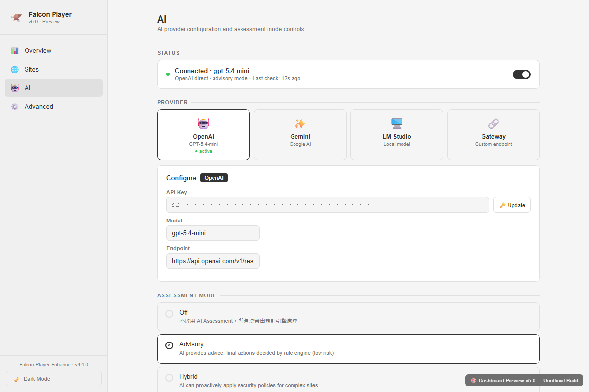
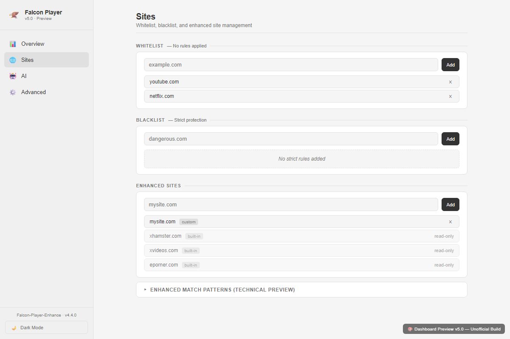
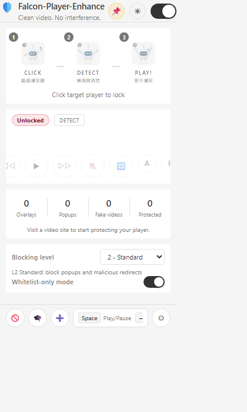

<p align="center">
  
</p>

<p align="center">
  <a href="https://developer.chrome.com/docs/extensions/mv3/"></a>
  
  <a href="https://opensource.org/licenses/MIT"></a>
  
</p>

<p align="center">
  <b>A Chrome extension specialized in player protection — overlay removal, popup blocking, player enhancement, AI-assisted analysis, and keyboard shortcuts.</b>
</p>

<p align="center">
  <a href="#-quick-start">Quick Start</a> •
  <a href="#-features">Features</a> •
  <a href="#-screenshots">Screenshots</a> •
  <a href="#%EF%B8%8F-keyboard-shortcuts">Shortcuts</a> •
  <a href="#-architecture">Architecture</a> •
  <a href="#-development">Development</a> •
  <a href="README.zh-TW.md">繁體中文</a> •
  <a href="docs/FEATURE_GUIDE.zh-TW.md">完整功能指南</a>
</p>

---

## Overview

**Falcon-Player-Enhance** is a Chrome extension purpose-built for **video player protection** on media websites. Unlike general-purpose ad blockers, it focuses on keeping your video player clean, functional, and enhanced.

| Capability | Description |
|------------|-------------|
| 🛡️ **Overlay Removal** | Auto-detects and removes ad overlays, click-hijack layers above the player |
| 🚫 **Popup Blocking** | Blocks malicious popups and unauthorized redirects |
| 🎬 **Player Enhancement** | Auto-detects players, adds controls, popup playback button |
| ⌨️ **Keyboard Shortcuts** | 14+ hotkeys for playback, volume, speed, and screenshot |
| 🖥️ **Distraction-Free Player** | Independent popup window with visual adjustments (brightness/contrast/hue/temperature) |
| 🤖 **AI-Assisted Analysis** | Integrates OpenAI / Gemini / LM Studio for real-time risk assessment |
| 🌐 **Network-Level Blocking** | 200+ ad domains blocked via declarativeNetRequest rules |

> 💡 **Recommended:** Use alongside [uBlock Origin Lite](https://chromewebstore.google.com/detail/ublock-origin-lite/ddkjiahejlhfcafbddmgiahcphecmpfh) for comprehensive ad blocking.

---

## 🚀 Quick Start

### Installation

```
1. Clone this repository
2. Open chrome://extensions/ in Chrome
3. Enable "Developer mode" (top right)
4. Click "Load unpacked" → select the extension/ directory
```

### Optional: AI Provider Setup

The extension supports multiple AI providers for enhanced ad detection:

| Provider | Type | Setup |
|----------|------|-------|
| **OpenAI** | Cloud API | Dashboard → AI tab → Enter API key |
| **Gemini** | Cloud API | Dashboard → AI tab → Enter API key |
| **LM Studio** | Local model | Start LM Studio server → Dashboard → AI tab → Health check |
| **Gateway** | Custom endpoint | Dashboard → AI tab → Enter custom URL |

See [INSTALL.md](INSTALL.md) for detailed setup instructions.

---

## ✨ Features

### 🛡️ Multi-Layer Protection

| Layer | Feature | Description |
|-------|---------|-------------|
| **Network** | DNR Rules | 200+ ad domains blocked at the network level |
| **DOM** | Overlay Removal | Removes ads and click-hijack layers covering the player |
| **DOM** | Fake Video Removal | Identifies and removes decoy video elements |
| **Script** | Anti-Adblock Bypass | Circumvents anti-adblock detection (MAIN world injection) |
| **Script** | Inject Blocker | Blocks malicious script injections in real time |
| **CSS** | Cosmetic Filter | Hides ad elements via CSS `display: none` rules |
| **Window** | Anti-Popup | Blocks unauthorized popups while allowing legitimate ones |

### 🎬 Player Enhancement

| Feature | Description |
|---------|-------------|
| **Auto Detection** | Scans for HTML5 `<video>`, `<iframe>`, and custom player frameworks |
| **Popup Player** | Open any detected video in a dedicated distraction-free window |
| **Visual Adjustments** | Brightness, contrast, saturation, hue, sharpness, color temperature |
| **Theme Toggle** | Dark / Light theme with localStorage persistence |
| **PiP Mode** | Picture-in-Picture for multitasking |
| **Pin Window** | Keep the player window always-on-top across tab switches |
| **Player Sync** | Synchronize playback state across multiple windows |
| **Auto Fit** | Automatically resize window to match video aspect ratio |

### 🤖 AI Integration

| Feature | Description |
|---------|-------------|
| **Multi-Provider** | OpenAI, Gemini, LM Studio, or custom Gateway |
| **Risk Assessment** | Real-time risk scoring with LOW / MEDIUM / HIGH / CRITICAL tiers |
| **Policy Gate** | Runtime policy engine that constrains AI actions |
| **Advisory / Hybrid** | Choose between AI-as-advisor or AI-with-autonomy modes |
| **Telemetry** | Action evidence logging (up to 1,500 entries) |

### 🔧 Tools

| Feature | Description |
|---------|-------------|
| **Element Picker** | Click any page element to create a custom blocking rule |
| **Enhanced Site Promotion** | Promote the current host into the enhanced-protection pool from the popup or dashboard |
| **4-Level Blocking** | OFF → BASIC → STANDARD → HARDENED protection levels |
| **Dashboard** | Full settings panel with 4 tabs: Overview / Sites / AI / Advanced |
| **Whitelist / Blacklist** | Per-site protection policies |

---

## 📸 Screenshots

### Distraction-Free Player

<p align="center">
  
</p>
<p align="center"><em>Distraction-Free Player (Dark Theme) — top info bar + video stage + control panel</em></p>

<p align="center">
  
</p>
<p align="center"><em>Distraction-Free Player (Light Theme) — frosted-glass panel effect</em></p>

### Dashboard

<p align="center">
  &nbsp;&nbsp;
  
</p>
<p align="center"><em>Left: Overview tab (stats + protection toggles) · Right: AI provider configuration</em></p>

<p align="center">
  &nbsp;&nbsp;
  
</p>
<p align="center"><em>Left: Site management (whitelist/blacklist) · Right: Advanced settings (policy gate, blocked elements)</em></p>

### Extension Popup

<p align="center">
  
</p>
<p align="center"><em>Browser action popup — 3-step flow guide, player detection, stats grid, blocking level</em></p>

> 📖 For a complete visual guide with detailed descriptions of every control, see **[FEATURE_GUIDE.zh-TW.md](docs/FEATURE_GUIDE.zh-TW.md)**.

---

## ⌨️ Keyboard Shortcuts

When a player is detected on the page, these shortcuts are automatically activated:

### Playback

| Key | Action |
|-----|--------|
| `Space` / `K` | Play / Pause |
| `←` / `→` | Seek ±5 seconds |
| `J` / `L` | Seek ±10 seconds |
| `Home` / `End` | Jump to start / end |
| `0`–`9` | Jump to 0%–90% (single press) |
| Two digits within 500ms | Jump to 00%–99% (e.g. `2` `5` → 25%) |

### Volume & Speed

| Key | Action |
|-----|--------|
| `↑` / `↓` | Volume ±10% |
| `M` | Toggle mute |
| `Shift` + `<` | Decrease speed |
| `Shift` + `>` | Increase speed |

> Speed steps: 0.25× → 0.5× → 0.75× → 1× → 1.25× → 1.5× → 1.75× → 2× → 2.5× → 3×

### Other

| Key | Action |
|-----|--------|
| `F` | Toggle fullscreen |
| `S` | Capture screenshot (PNG) |
| `L` | Toggle loop |
| `[` / `]` | Set A-B loop start / end |

---

## 🏗 Architecture

```
extension/
├── manifest.json                 # MV3 config
├── background.js                 # Service Worker — state, rules, windows, messages
├── content/
│   ├── player-detector.js        # Player detection (ISOLATED)
│   ├── player-enhancer.js        # Player enhancement + popup button (ISOLATED)
│   ├── player-controls.js        # Keyboard shortcuts (ISOLATED)
│   ├── player-sync.js            # Cross-window sync (ISOLATED)
│   ├── overlay-remover.js        # Overlay removal (ISOLATED)
│   ├── fake-video-remover.js     # Fake video removal (ISOLATED)
│   ├── anti-antiblock.js         # Anti-adblock bypass (MAIN world)
│   ├── inject-blocker.js         # Script injection blocker (MAIN world)
│   ├── cosmetic-filter.js        # CSS cosmetic filter (ISOLATED)
│   ├── anti-popup.js             # Popup blocker (ISOLATED)
│   ├── element-picker.js         # Manual element selector
│   └── ai-runtime.js             # AI runtime bridge
├── popup/                        # Browser action popup UI
├── popup-player/                 # Distraction-free player window
├── dashboard/                    # Settings dashboard (4 tabs)
├── rules/
│   ├── filter-rules.json         # declarativeNetRequest rules
│   ├── ad-list.json              # Known ad domain list
│   └── site-registry.json        # Enhanced site definitions
├── sandbox/                      # Sandboxed execution
└── security/                     # URL checking utilities
```

### Module Overview

| Module | World | Role |
|--------|-------|------|
| `background.js` | Service Worker | State management, rule engine, AI pipeline, window management |
| `anti-antiblock.js` | MAIN | Spoofs ad APIs (AdSense, DFP, IMA SDK) to bypass detection |
| `inject-blocker.js` | MAIN | Hooks XHR/fetch/DOM to block malicious injections |
| `player-detector.js` | ISOLATED | Scans for video/iframe players with stable ID hashing |
| `player-enhancer.js` | ISOLATED | Adds visual markers, popup button, z-index optimization |
| `overlay-remover.js` | ISOLATED | Removes click-hijack and ad overlay layers |
| `cosmetic-filter.js` | ISOLATED | Site-specific CSS hiding rules |
| `anti-popup.js` | ISOLATED | Blocks popups while preserving age-gate dialogs |

### Message Flow

```
Content Scripts ──playerDetected──▶ background.js ──▶ chrome.windows.create()
                                         │                     │
popup.js ──controlCommand──▶ background.js ──▶ content script (source tab)
                                         │
popup-player.js ◀──playerSync──▶ content script (via sourceTabId)
                                         │
All scripts ──statsUpdate──▶ background.js ──aipolicyUpdate──▶ All scripts
```

---

## 🧪 Development

### Test Commands

```bash
npm run check                # Main local quality gate (JS + rules + targets + Python live-browser unit tests)
npm run test:python          # Live-browser Python unit tests only
npm run test:ai              # AI evaluation suite
npm run test:e2e-replay       # End-to-end replay tests
npm run test:lmstudio         # LM Studio integration tests
npm run check:lmstudio        # LM Studio health check
```

### Tech Stack

- **Platform:** Chrome Extension (Manifest V3)
- **APIs:** declarativeNetRequest · Scripting · Storage · Tabs · SidePanel · Windows
- **Languages:** JavaScript · HTML · CSS
- **AI:** OpenAI API · Gemini API · LM Studio (local) · Custom Gateway

### Regenerate Screenshots

```bash
node docs/take-screenshots.js
```

---

## 📄 Documentation

| Document | Description |
|----------|-------------|
| [FEATURE_GUIDE.zh-TW.md](docs/FEATURE_GUIDE.zh-TW.md) | Complete feature guide with screenshots (繁體中文) |
| [INSTALL.md](INSTALL.md) | Installation and setup instructions |
| [AI_INTEGRATED_VERSION.zh-TW.md](docs/AI_INTEGRATED_VERSION.zh-TW.md) | AI Edition fork documentation |

---

## 🤝 Contributing

Contributions are welcome! Please open an Issue first to discuss proposed changes.

---

## 📜 License

This project is licensed under the [MIT License](LICENSE).

---

## 🤖 AI-Assisted Development

This project was developed with AI assistance.

**AI Models Used:**
- Gemini 2.5 Pro (Google DeepMind) — initial development
- Claude Opus 4.6 (Anthropic) — architecture review, UI redesign, documentation

> ⚠️ **Disclaimer:** While the author has made every effort to review and validate the AI-generated code, no guarantee can be made regarding its correctness, security, or fitness for any particular purpose. Use at your own risk.
