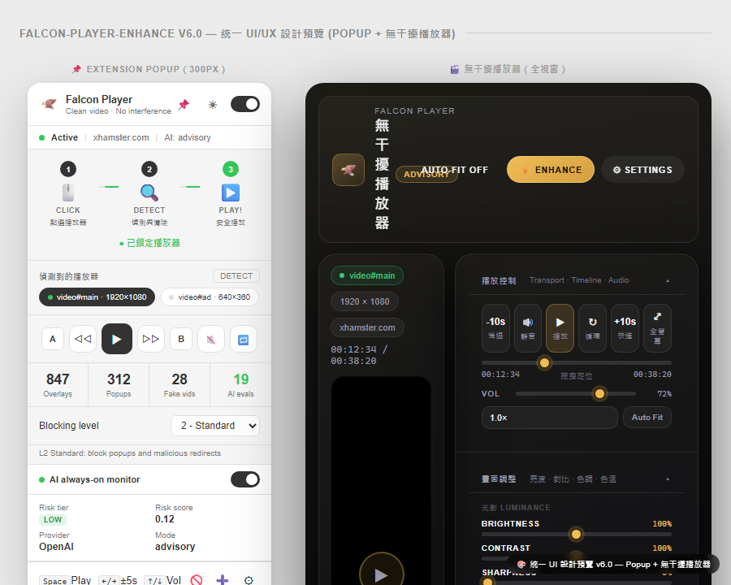
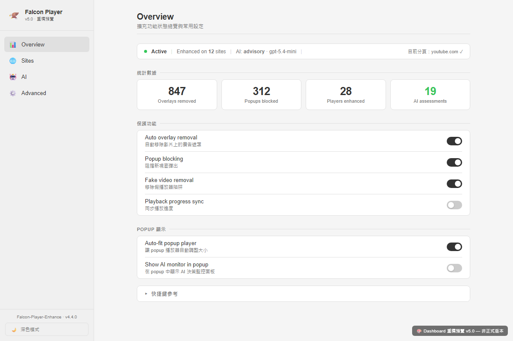
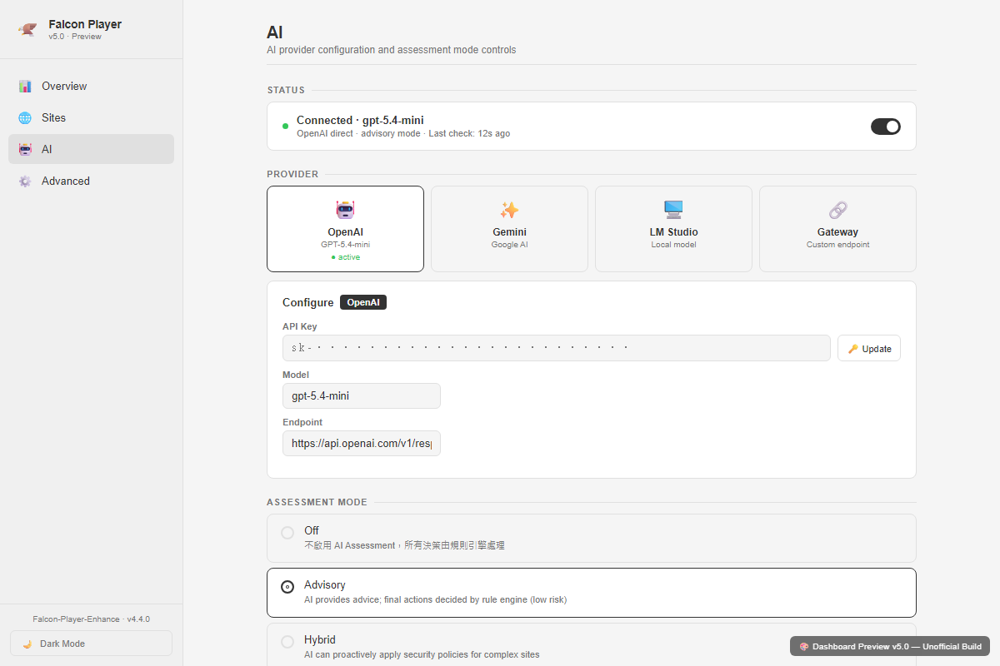
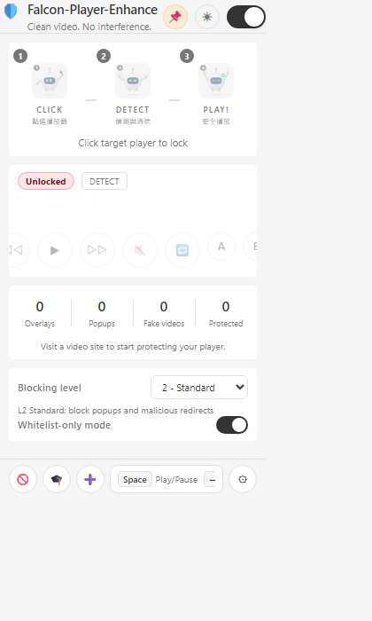

[](docs/banner.png)

# Falcon-Player-Enhance


[](LICENSE)

> 讓惡劣播放器頁面恢復乾淨播放：播放器周邊清理、彈窗與導流防護、可回復的誤判處理，以及 AI 輔助策略審核。

[快速開始](#-快速開始) · [功能特色](#-功能特色) · [截圖預覽](#-截圖預覽) · [快捷鍵](#-鍵盤快捷鍵) · [架構](#-架構) · [開發](#-開發) · [文件](#-文件) · [English](README.md)

---

## 🎯 概述

**Falcon-Player-Enhance** 專注保護媒體網站上的影片播放器區域，處理廣告覆蓋層、彈窗、假播放器、點擊陷阱與惡意導流對播放體驗造成的干擾。它不是要取代 uBlock Origin Lite 這類廣域 blocker，而是補上播放器修復、可回復清理與 AI 候選規則審核這一層。

| 能力 | 說明 |
|---|---|
| 🛡️ **播放器周邊清理** | 移除播放器附近的覆蓋層、假影片與點擊劫持層 |
| 🚫 **彈窗與導流防護** | 攔截受管理播放器頁面產生的可疑新分頁與同頁外站導流 |
| 🧯 **誤判恢復** | 掃描可回復 Falcon 操作、預覽恢復、單次恢復、記錄負面證據 |
| 🎬 **無干擾播放器** | 將偵測到的播放器開進獨立播放視窗，並提供影像調整 |
| 🤖 **AI 輔助策略審核** | 將 runtime 風險訊號整理成 advisory 或候選規則，並經過 Policy Gate |
| 🧠 **Provider Profiles** | 支援 OpenAI、Gemini、LM Studio、Chrome Built-in AI 與自訂 gateway |
| ⌨️ **鍵盤控制** | 播放、快轉、速度、音量、截圖、全螢幕與循環快捷鍵 |

> 💡 **建議：** 搭配 [uBlock Origin Lite](https://chromewebstore.google.com/detail/ublock-origin-lite/ddkjiahejlhfcafbddmgiahcphecmpfh) 使用。uBOL 處理廣域廣告與追蹤阻擋；Falcon 專注播放器修復、彈窗恢復、誤判救援與播放器周邊 hostile behavior。

---

## 🚀 快速開始

### 安裝

```bash
# 1. Clone repository
git clone https://github.com/pingqLIN/Falcon-Player-Enhance.git
cd Falcon-Player-Enhance

# 2. 開啟 Chrome Extensions
# chrome://extensions/

# 3. 啟用 Developer mode

# 4. 載入未封裝擴充功能目錄
# 選擇：Falcon-Player-Enhance/extension
```

### 選用 AI Provider 設定

AI 功能是選用的；沒有 provider 時，Falcon 仍會保留核心播放器防護。

| Provider | 類型 | 設定 |
|---|---|---|
| **OpenAI** | 雲端 API | Dashboard → AI provider → 輸入 endpoint、model 與 API key |
| **Gemini** | 雲端 API | Dashboard → AI provider → 輸入 endpoint、model 與 API key |
| **LM Studio** | 本機模型 | 啟動本機 server 後，在 Dashboard 執行 health check |
| **Chrome Built-in AI** | 瀏覽器本機能力 | 選取 Chrome Built-in、恢復預設值，再執行 capability health check |
| **Gateway** | 自訂端點 | 輸入相容 gateway URL 與 model name |

Provider secrets 以 session-scoped extension storage 保存；非機密的 provider profile 與預設值會分開持久化。

詳細設定請見 [INSTALL.md](INSTALL.md)。

---

## ✨ 功能特色

### 🛡️ 防護層

| 層級 | 功能 | 說明 |
|---|---|---|
| **Network** | Baseline DNR guardrails | 以高信心規則處理惡意導流、彈窗陷阱與播放器周邊高風險網域 |
| **DOM** | 覆蓋層清理 | 移除或解除播放器上方與周邊的可見干擾 |
| **DOM** | 假影片偵測 | 在假影片偷走點擊或干擾控制前辨識它們 |
| **MAIN world** | Anti-anti-adblock repair | 在 isolated script 不足時套用播放器站點相容性修復 |
| **CSS** | 保守 cosmetic filter | 清理播放器周邊元素，而非做全頁廣告規則競賽 |
| **Window** | 彈窗與導流恢復 | 關閉可疑新分頁，並恢復可疑同頁外站導流 |
| **Recovery** | 誤判恢復 | 還原被隱藏或被阻擋點擊的元素，並記錄 future candidate review 的負面證據 |

### 🧯 誤判恢復

| 控制 | 說明 |
|---|---|
| **Scan page** | 找出目前頁面可回復的 Falcon 操作 |
| **Preview** | 暫時顯示被隱藏元素或恢復可點擊性，便於檢查 |
| **Restore once** | 對目前頁面 session 單次還原某個 Falcon 操作 |
| **Report false positive** | 將誤判觀察寫成結構化負面證據 |
| **Candidate gate** | 若候選規則命中近期誤判證據，阻止 promotion |

### 🤖 AI 策略流程

Falcon 不讓 runtime AI 直接永久修改 durable rules。Runtime 訊號會先被正規化，AI 可以整理風險或提出候選規則，再由 Policy Gate 判斷下一步。

```text
Site signals
  -> rules and heuristics
  -> AI advisory / generated candidates
  -> Policy Gate
       -> reversible runtime hardening
       -> manual or development-time review
       -> durable rule update outside runtime AI authority
```

| 邊界 | Falcon 行為 |
|---|---|
| **Runtime signals** | 彈窗事件、導流嘗試、覆蓋層操作、播放器 context、粗粒度元素證據 |
| **AI advisory** | 風險摘要與待審核的 candidate selectors/domains |
| **Policy Gate** | 依 tier、confidence、mode 與負面證據約束 AI-driven actions |
| **Durable mutation** | 保留在 runtime AI 權限外；正式規則需要人工審核或開發流程 |
| **Privacy posture** | API secrets 不寫入 local persisted profiles；prompt 使用正規化證據而非原始頁面傾倒 |

### 🎬 播放器工具

| 工具 | 說明 |
|---|---|
| **播放器偵測** | 偵測 HTML5 video、iframe players 與自訂 embedded players |
| **Popup player** | 將偵測到的播放器開啟到獨立播放視窗 |
| **影像控制** | 亮度、對比、飽和度、色相、銳利度與色溫 |
| **主題切換** | 暗色與亮色播放器主題，並保存偏好 |
| **Picture-in-Picture** | 對支援的 video element 啟用瀏覽器 PiP |
| **State sync** | 盡可能同步來源分頁與 popup player 狀態 |
| **Element picker** | 從目前頁面建立精準的自訂元素規則 |

---

## 📸 截圖預覽

### 無干擾播放器

[](docs/screenshots/01-player-dark-full.png)

*暗色播放視窗 — 影片舞台、頂部狀態與緊湊控制列*

[](docs/screenshots/03-player-light-full.png)

*亮色播放視窗 — 毛玻璃控制面板與影像調整控制*

### Dashboard

[](docs/screenshots/05-dashboard-overview.png)

*Dashboard overview — 防護狀態、開關與站點控制*

[](docs/screenshots/07-dashboard-ai.png)

*AI provider settings — provider profiles、health checks、policy mode 與 candidates*

### Extension Popup

[](docs/screenshots/09-popup-main.png)

*Browser action popup — 目標播放器選擇、防護等級、誤判恢復與快捷鍵*

> 📖 完整視覺導覽請見 [FEATURE_GUIDE.zh-TW.md](docs/FEATURE_GUIDE.zh-TW.md)。

---

## ⌨️ 鍵盤快捷鍵

Falcon 鎖定可控制播放器後，快捷鍵會自動啟用。

### 播放

| 按鍵 | 動作 |
|---|---|
| `Space` / `K` | 播放或暫停 |
| `←` / `→` | 快轉 ±5 秒 |
| `J` / `L` | 快轉 ±10 秒 |
| `Home` / `End` | 跳到開頭或結尾 |
| `0`-`9` | 跳到 0%-90% |
| 500ms 內連按兩位數 | 跳到 00%-99%，例如 `2` 再按 `5` → 25% |

### 音量與速度

| 按鍵 | 動作 |
|---|---|
| `↑` / `↓` | 音量 ±10% |
| `M` | 靜音切換 |
| `Shift` + `<` | 降低速度 |
| `Shift` + `>` | 提高速度 |

### 其他

| 按鍵 | 動作 |
|---|---|
| `F` | 全螢幕切換 |
| `S` | 截圖 |
| `L` | 循環播放切換 |
| `[` / `]` | 設定 A-B loop 起點與終點 |

---

## 🏗 架構

```text
extension/
├── manifest.json                 # MV3 設定
├── background.js                 # Service worker: state, policy, AI, windows, rules
├── content/
│   ├── player-detector.js        # 播放器偵測
│   ├── player-enhancer.js        # 播放器控制與 popup 入口
│   ├── player-controls.js        # 鍵盤快捷鍵
│   ├── player-sync.js            # 來源分頁與 popup-player sync
│   ├── overlay-remover.js        # 覆蓋層與 click-blocking 清理
│   ├── direct-popup-overlay.js   # Falcon-owned UI overlay marker path
│   ├── cosmetic-filter.js        # 保守 CSS 清理
│   ├── anti-popup.js             # Popup guard
│   ├── anti-antiblock.js         # MAIN-world player-site repair
│   ├── inject-blocker.js         # Script injection guard
│   ├── element-picker.js         # 手動阻擋規則 picker
│   └── ai-runtime.js             # AI runtime bridge
├── popup/                        # Browser action popup and side-panel shell
├── popup-player/                 # 無干擾播放器視窗
├── dashboard/                    # 設定、AI provider profiles、rescue tools
├── rules/                        # DNR rules、site registry、ad domain list
├── sandbox/                      # Sandboxed helper page
├── security/                     # URL and threat helpers
└── shared/                       # Shared helpers
```

### Module Overview

| Module | World | Role |
|---|---|---|
| `background.js` | Service Worker | 狀態保存、DNR 更新、AI policy、candidate review、誤判記錄 |
| `player-detector.js` | ISOLATED | 找出播放器並產生穩定 target IDs |
| `player-enhancer.js` | ISOLATED | 加入 Falcon 控制，並把 Falcon-owned UI 標記為 internal |
| `overlay-remover.js` | ISOLATED | 在隱藏或解除干擾前記錄可回復 overlay actions |
| `cosmetic-filter.js` | ISOLATED | 套用保守 CSS rules，並尊重已 rescue 的元素 |
| `anti-popup.js` | ISOLATED | 攔截可疑 popup flow，同時保留合法 dialog |
| `anti-antiblock.js` | MAIN | 在需要攔截頁面 script 時修復播放器相容性 |
| `dashboard.js` | Extension page | 設定 providers、candidates、blocked elements、rescue controls 與 site lists |

### Message Flow

```text
Content scripts
  -> background.js: playerDetected, statsUpdate, recordFalconAction
  -> popup/dashboard: status, rescue records, candidates

popup.js / dashboard.js
  -> background.js: controlCommand, provider settings, scan rescue, promote candidate
  -> content scripts: restore action, preview action, refresh rescue state

AI provider
  -> background.js: advisory or generated candidates
  -> Policy Gate: reversible action or review queue
```

---

## 🧪 開發

### 高訊號檢查

```bash
node --check extension/background.js
node --check extension/dashboard/dashboard.js

npm run test:ai:element-classification
npm run test:ai:element-classification:behavior
npm run test:ai:chrome-builtin-element
npm run test:ai:provider-profiles
npm run test:ai:candidate-promotion
npm run test:interaction-safety
npm run test:popup:smoke
```

### 工具命令

```bash
npm run docs:screenshots          # 重新產生 README 與 guide 截圖
npm run check:lmstudio            # 檢查本機 LM Studio endpoint
npm run check:gateway             # 檢查自訂 gateway endpoint
npm run browser:workflow          # 執行本機 browser workflow helper
```

### 技術棧

| 區域 | Stack |
|---|---|
| **Platform** | Chrome Extension Manifest V3 |
| **Extension APIs** | declarativeNetRequest, scripting, storage, tabs, sidePanel, windows, webNavigation |
| **Languages** | JavaScript, HTML, CSS |
| **AI Providers** | OpenAI, Gemini, LM Studio, Chrome Built-in AI, custom gateway |
| **Tests** | Node.js checks, Python regression harnesses, Playwright-backed browser workflows |

---

## 📄 文件

| 文件 | 說明 |
|---|---|
| [INSTALL.md](INSTALL.md) | 安裝與 provider 設定 |
| [FEATURE_GUIDE.zh-TW.md](docs/FEATURE_GUIDE.zh-TW.md) | 含截圖的完整功能導覽 |
| [AI_CAPABILITY_BOUNDARY.zh-TW.md](docs/AI_CAPABILITY_BOUNDARY.zh-TW.md) | AI 能力邊界與 runtime 權限 |
| [AI_POLICY_GATE_PARAMETERS.zh-TW.md](docs/AI_POLICY_GATE_PARAMETERS.zh-TW.md) | Policy Gate tier 與參數 |
| [BLOCKED_ELEMENTS_FEATURE.zh-TW.md](docs/BLOCKED_ELEMENTS_FEATURE.zh-TW.md) | 自訂封鎖元素流程 |
| [PROTECTION_STATUS_CONTRACT_2026-04-25.zh-TW.md](docs/PROTECTION_STATUS_CONTRACT_2026-04-25.zh-TW.md) | 防護狀態 contract |
| [LIVE_BROWSER_SAFE_TESTING.zh-TW.md](docs/LIVE_BROWSER_SAFE_TESTING.zh-TW.md) | 安全 live-browser 測試流程 |

Local planning notes、raw AI discussions 與 implementation memos 應放在 `docs/local/`、`ai-private/`、`ai-discussion/` 或 `local/`；這些路徑不屬於 publishable documentation surface。

---

## 🤝 Contributing

歡迎貢獻。若變更會影響合法頁面互動、provider integration 或防護規則，請先開 issue 討論。

---

## 🤖 AI-Assisted Development

This project was developed with AI assistance.

| Model | Role |
|---|---|
| Gemini 2.5 Pro (Google DeepMind) | 初期功能規劃與實作審查 |
| Claude Opus 4.6 (Anthropic) | 架構審查、UI redesign、文件審查 |
| OpenAI Codex | Repository maintenance、README rewrite、pre-push verification support |

> ⚠️ **Disclaimer:** While the author has made every effort to review and validate the AI-generated code, no guarantee can be made regarding its correctness, security, or fitness for any particular purpose. Use at your own risk.

---

## 📜 License

[MIT License](LICENSE)
