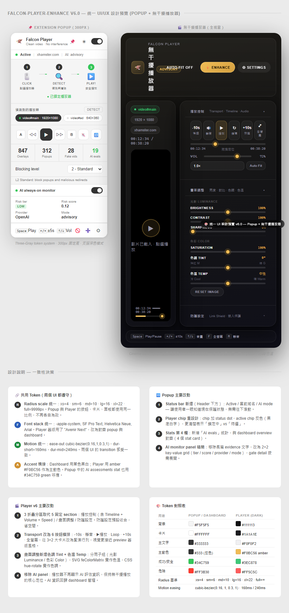

# Falcon-Player-Enhance v4.4.0 — 功能說明文件

> Chrome 擴充功能（Manifest V3）— 播放器保護、廣告攔截、AI 輔助增強
>
> 本文件涵蓋每一項功能的詳細說明、操作方式，及搭配截圖導覽。

---

## 目錄

- [1. 快速總覽](#1-快速總覽)
- [2. 擴充功能彈出視窗（Popup）](#2-擴充功能彈出視窗popup)
  - [2.1 三步驟操作流程](#21-三步驟操作流程)
  - [2.2 播放器偵測與鎖定](#22-播放器偵測與鎖定)
  - [2.3 播放控制列](#23-播放控制列)
  - [2.4 統計數據面板](#24-統計數據面板)
  - [2.5 封鎖等級控制](#25-封鎖等級控制)
  - [2.6 AI 監控面板](#26-ai-監控面板)
  - [2.7 工具列與快捷鍵](#27-工具列與快捷鍵)
- [3. 無干擾播放器（Popup Player）](#3-無干擾播放器popup-player)
  - [3.1 播放模式](#31-播放模式)
  - [3.2 頂部工具列](#32-頂部工具列)
  - [3.3 播放控制區（① 播放控制）](#33-播放控制區-播放控制)
  - [3.4 畫面調整區（② 畫面調整）](#34-畫面調整區-畫面調整)
  - [3.5 防護設定區（③ 防護設定）](#35-防護設定區-防護設定)
  - [3.6 明亮 / 黑暗主題切換](#36-明亮--黑暗主題切換)
- [4. 設定面板（Dashboard）](#4-設定面板dashboard)
  - [4.1 Overview — 總覽](#41-overview--總覽)
  - [4.2 Sites — 站點管理](#42-sites--站點管理)
  - [4.3 AI — 人工智慧設定](#43-ai--人工智慧設定)
  - [4.4 Advanced — 進階設定](#44-advanced--進階設定)
- [5. 內容腳本與保護機制](#5-內容腳本與保護機制)
  - [5.1 播放器偵測（player-detector）](#51-播放器偵測player-detector)
  - [5.2 覆蓋層移除（overlay-remover）](#52-覆蓋層移除overlay-remover)
  - [5.3 假影片移除（fake-video-remover）](#53-假影片移除fake-video-remover)
  - [5.4 播放器增強（player-enhancer）](#54-播放器增強player-enhancer)
  - [5.5 反反廣告偵測（anti-antiblock）](#55-反反廣告偵測anti-antiblock)
  - [5.6 注入攔截器（inject-blocker）](#56-注入攔截器inject-blocker)
  - [5.7 外觀過濾器（cosmetic-filter）](#57-外觀過濾器cosmetic-filter)
  - [5.8 反彈窗（anti-popup）](#58-反彈窗anti-popup)
  - [5.9 播放同步（player-sync）](#59-播放同步player-sync)
- [6. 鍵盤快捷鍵完整對照表](#6-鍵盤快捷鍵完整對照表)
- [7. 網路層廣告攔截（DNR 規則）](#7-網路層廣告攔截dnr-規則)
- [8. 系統架構圖](#8-系統架構圖)

---

## 1. 快速總覽

Falcon-Player-Enhance 是一款專為**影片播放場景**設計的 Chrome 擴充功能，提供以下核心能力：

| 能力 | 說明 |
|------|------|
| 🛡️ **覆蓋層移除** | 自動偵測並移除影片上方的廣告覆蓋層、點擊劫持層 |
| 🚫 **彈窗攔截** | 阻擋惡意彈出視窗和重新導向 |
| 🎬 **播放器增強** | 為偵測到的播放器加上快捷控制和彈出播放按鈕 |
| ⌨️ **鍵盤快捷鍵** | 14+ 組快捷鍵控制播放、音量、速度、截圖 |
| 🖥️ **無干擾播放器** | 獨立視窗播放，支援畫面調整（亮度/對比/色調/色溫） |
| 🤖 **AI 輔助分析** | 串接 OpenAI / Gemini / LM Studio，即時風險評估 |
| 🌐 **網路層攔截** | 透過 declarativeNetRequest 封鎖 200+ 廣告網域 |

---

## 2. 擴充功能彈出視窗（Popup）

> 點擊瀏覽器工具列上的擴充功能圖示即可開啟，也可釘選為側邊面板。


*圖：Popup 主畫面 — 顯示三步驟流程指引、播放器偵測區、統計數據及封鎖等級控制*

### 2.1 三步驟操作流程

Popup 頂部以視覺流程圖引導使用者：

| 步驟 | 圖示 | 動作 |
|------|------|------|
| ① CLICK | 🖱️ 點選播放器 | 在頁面上點擊目標播放器 |
| ② DETECT | 🔍 偵測與清除 | 擴充功能掃描並移除廣告覆蓋 |
| ③ PLAY! | ▶️ 安全播放 | 播放器已受保護，開始觀看 |

狀態文字會即時更新，顯示「Click target player to lock」或「● 已鎖定播放器」。

### 2.2 播放器偵測與鎖定

- **Unlocked / Locked 徽章**：顯示目前是否已鎖定特定播放器
- **DETECT 按鈕**：手動觸發重新掃描
- **播放器晶片列表**：偵測到多個播放器時，以晶片（chip）形式列出，例如 `video#main · 1920×1080`、`video#ad · 640×360`
- **自動掃描**：Popup 模式每 1 秒掃描一次，側邊面板模式每 4 秒一次

### 2.3 播放控制列

鎖定播放器後顯示以下控制：

| 按鈕 | 功能 |
|------|------|
| ◁◁ | 後退 5 秒 |
| ▶ | 播放 / 暫停 |
| ▷▷ | 快進 5 秒 |
| 🔇 | 靜音切換 |
| 🔁 | 循環播放切換 |
| A / B | AB 循環標記點 |
| 🎬 | 開啟無干擾播放器 |

### 2.4 統計數據面板

四格統計卡片即時顯示：

| 指標 | 說明 |
|------|------|
| **Overlays** | 已移除的覆蓋層數量 |
| **Popups** | 已攔截的彈窗數量 |
| **Fake videos** | 已移除的假影片數量 |
| **Protected** | 已保護的播放器數量 |

### 2.5 封鎖等級控制

四級封鎖系統，由使用者依需求選擇：

| 等級 | 名稱 | 說明 |
|------|------|------|
| L0 | OFF | 關閉所有封鎖功能 |
| L1 | BASIC | 僅移除覆蓋層 |
| L2 | STANDARD | 攔截彈窗及惡意重新導向（預設） |
| L3 | HARDENED | 完全封鎖模式，最嚴格 |

另有 **Whitelist-only mode** 開關 — 開啟後僅對白名單中的網站啟用保護。

### 2.6 AI 監控面板

可折疊的即時 AI 監控儀表板，高風險時自動展開：

| 欄位 | 說明 |
|------|------|
| Risk tier | 風險等級：LOW / MEDIUM / HIGH / CRITICAL |
| Risk score | 數值化風險分數（0.00 – 1.00） |
| High-risk domains | 高風險網域計數 |
| Telemetry size | 遙測紀錄大小（上限 1500 筆） |
| Provider / Mode | 目前使用的 AI 服務商與模式 |
| Gate tier / Mode / Reason | 政策閘門的層級與執行原因 |
| Evidence | 最近 8 筆動作紀錄 |

### 2.7 工具列與快捷鍵

底部工具列提供快速存取：

| 按鈕 | 功能 |
|------|------|
| 🚫 | Pick Element — 選取元素模式（手動標記廣告） |
| 🤖 | Teach Element — AI 學習模式 |
| ＋ | 新增功能（保留） |
| ⚙ | 開啟 Dashboard 設定面板 |
| 快捷鍵參考 | 可展開的快捷鍵速查表 |

---

## 3. 無干擾播放器（Popup Player）

> 獨立彈出視窗，提供乾淨、無廣告的影片觀看體驗。

### 暗色主題


*圖：無干擾播放器（暗色主題）— 頂部資訊列 + 影片舞台 + 右側控制面板*

### 明亮主題


*圖：無干擾播放器（明亮主題）— 同樣的佈局，明亮配色方案*

### 完整頁面（含所有控制區塊）



*圖：無干擾播放器完整頁面 — 包含三個可收合控制區塊與底部快捷鍵參考列*

### 3.1 播放模式

播放器根據來源自動選擇模式：

| 模式 | 來源 | 說明 |
|------|------|------|
| **Video** | HTML5 `<video>` | 直接播放，完整控制權 |
| **Iframe** | YouTube / Vimeo 等嵌入 | 沙箱化 iframe，有限控制 |
| **Remote** | 從 Popup 遠端控制 | 透過訊息傳遞控制原頁面播放器 |
| **Idle** | 無有效來源 | 錯誤狀態 |

### 3.2 頂部工具列

| 按鈕 | 功能 |
|------|------|
| 📌 Pin | 釘選視窗（保持置頂，切換分頁不關閉） |
| 🖼 PiP | 子母畫面模式（僅 Video 模式可用） |
| ☀ / 🌙 主題 | 明亮 / 黑暗主題切換 |
| ✕ 關閉 | 關閉播放器（需先取消釘選） |

狀態列顯示：播放模式標籤、來源網址

### 3.3 播放控制區（① 播放控制）

> 預設展開的第一個可收合區塊

**傳輸控制按鈕**

| 按鈕 | 功能 |
|------|------|
| -10s 倒轉 | 後退 10 秒 |
| 靜音 | 靜音/取消靜音 |
| ▶ 播放 | 播放/暫停切換 |
| 循環 | 循環播放開關 |
| +10s 快進 | 快進 10 秒 |
| 全螢幕 | 全螢幕切換 |

**時間軸與進度**

- 拖曳定位列即時跳轉
- 顯示格式：`HH:MM:SS / HH:MM:SS`（目前位置 / 總長度）

**音量滑桿**

- 範圍：0% – 100%
- 即時數值顯示
- 與靜音按鈕連動

**播放速度選擇器**

- 可選值：0.5×、0.75×、1.0×、1.25×、1.5×、2.0×
- 下拉選單即時切換

**Auto Fit 自動適配**

- 開啟後，視窗自動調整為影片原始比例
- 最大尺寸限制：1480×900

### 3.4 畫面調整區（② 畫面調整）

> 預設展開的第二個可收合區塊。分為 **光影 Luminance** 與 **色彩 Color** 兩個子組。

#### 光影 LUMINANCE

| 控制項 | 範圍 | 預設值 | 技術實作 |
|--------|------|--------|----------|
| **亮度 Brightness** | 50% – 200% | 100% | CSS `filter: brightness()` |
| **對比 Contrast** | 50% – 200% | 100% | CSS `filter: contrast()` |
| **銳化 Sharpness** | 0% – 100% | 0% | SVG `feConvolveMatrix`（3 級銳化核心） |

#### 色彩 COLOR

| 控制項 | 範圍 | 預設值 | 技術實作 |
|--------|------|--------|----------|
| **飽和度 Saturation** | 0% – 200% | 100% | CSS `filter: saturate()` |
| **色調 Tint（洋紅/綠）** | -20° – +20° | 0° | CSS `filter: hue-rotate()` |
| **色溫 Temperature** | -50 – +50 | 中性 | SVG `feColorMatrix` 色彩矩陣變換 |

- **RESET IMAGE 按鈕**：一鍵重置所有調整回預設值
- 所有調整即時預覽，無需重新載入

### 3.5 防護設定區（③ 防護設定）

> 預設收合的第三個可收合區塊

| 控制項 | 功能 |
|--------|------|
| **Link Shield** | 開啟互動遮罩，阻擋 iframe 嵌入頁面內的跨站點擊 |
| **Reset Stage** | 完整重置（控制、調整值、播放位置全部歸零） |
| **提示框** | 說明 Link Shield 在 iframe 模式下的作用 |

### 3.6 明亮 / 黑暗主題切換

- 點擊頂部工具列 ☀ / 🌙 按鈕切換
- 偏好設定透過 `localStorage('player-theme')` 自動儲存
- 下次開啟播放器時自動載入上次選擇
- **暗色主題**：深色背景、金色（amber）強調色
- **明亮主題**：淺色背景、毛玻璃面板效果、暖色調
- **影片區域**在兩個主題下都維持暗色（模擬螢幕觀看體驗）

---

## 4. 設定面板（Dashboard）

> 從 Popup 底部 ⚙ 按鈕或 Chrome 擴充功能選項頁面開啟。
> 採用 4 個分頁的側邊欄導航設計。

### 4.1 Overview — 總覽


*圖：Dashboard 總覽頁面 — 狀態列、統計卡片、保護功能開關、Popup 顯示設定*

#### 狀態列

顯示一行式狀態摘要：
```
● Active | Enhanced on 12 sites | AI: advisory · gpt-5.4-mini | 目前分頁：youtube.com ✓
```

#### 統計數據（4 欄）

| 指標 | 說明 |
|------|------|
| **Overlays removed** | 累計移除覆蓋層數 |
| **Popups blocked** | 累計攔截彈窗數 |
| **Players enhanced** | 累計保護播放器數 |
| **AI assessments** | 累計 AI 評估次數 |

#### 保護功能開關

| 功能 | 說明 | 預設 |
|------|------|------|
| Auto overlay removal | 自動移除影片上的廣告遮罩 | ✅ 開 |
| Popup blocking | 阻擋新視窗彈出 | ✅ 開 |
| Fake video removal | 移除假播放器陷阱 | ✅ 開 |
| Playback progress sync | 同步播放進度（跨視窗） | ⬜ 關 |

#### Popup 顯示設定

| 設定 | 說明 |
|------|------|
| Auto-fit popup player | 讓 Popup 播放器自動調整大小 |
| Show AI monitor in popup | 在 Popup 中顯示 AI 決策監控面板 |

#### 快捷鍵參考

可折疊區塊，列出完整鍵盤快捷鍵對照表。

---

### 4.2 Sites — 站點管理


*圖：Dashboard 站點管理 — 白名單、黑名單、增強站點三區管理*

#### 白名單 — 不套用任何規則

- 輸入網域 → 點擊 **Add** → 該網域將完全跳過保護
- 已加入的網域右側有 × 可移除
- 用途：對信任的網站停用擴充功能

#### 黑名單 — 嚴格保護

- 輸入網域 → 點擊 **Add** → 對該網域啟用最嚴格保護
- 用途：已知有大量廣告的網站

#### 增強站點

兩種類型的站點：

| 類型 | 標籤 | 說明 |
|------|------|------|
| **built-in** | `built-in` | 預設的增強站點清單（來自 `site-registry.json`），為唯讀 |
| **custom** | `custom` | 使用者自行新增的站點，可移除 |

增強站點會載入額外的內容腳本（anti-antiblock、inject-blocker、cosmetic-filter、anti-popup），提供比一般網站更完整的保護。

#### Enhanced Match Patterns（技術預覽）

可展開的技術區塊，顯示實際注入的 URL 匹配模式。

---

### 4.3 AI — 人工智慧設定


*圖：Dashboard AI 設定 — 服務商選擇、連線狀態、API 設定、評估模式*

#### 狀態指示器

```
● Connected · gpt-5.4-mini
OpenAI direct · advisory mode · Last check: 12s ago
```

右側有 AI 總開關，可一鍵停用 AI 功能。

#### Provider 服務商選擇

以卡片式 UI 呈現 4 個可用服務商：

| Provider | 說明 | 特色 |
|----------|------|------|
| **OpenAI** | GPT 系列模型 | 雲端 API，效能穩定 |
| **Gemini** | Google AI | 雲端 API，中文能力強 |
| **LM Studio** | 本地模型 | 離線執行，隱私優先 |
| **Gateway** | 自訂端點 | 支援自建 API 閘道 |

選中的卡片顯示 `● active` 綠色標籤。

#### Configure 設定區

根據選擇的服務商顯示對應設定：

| 欄位 | 說明 |
|------|------|
| API Key | 金鑰輸入（遮罩顯示 `sk-·····`） |
| Model | 模型名稱（如 `gpt-5.4-mini`） |
| Endpoint | API 端點 URL |
| Timeout | 請求逾時時間（LM Studio 專用，預設 4000ms） |
| Cooldown | 冷卻時間（LM Studio 專用，預設 25000ms） |

#### 評估模式

三種 AI 參與程度：

| 模式 | 說明 |
|------|------|
| **Off** | 不啟用 AI 評估，所有決策由規則引擎處理 |
| **Advisory** | AI 提供建議，最終動作仍由規則引擎決定（低風險） |
| **Hybrid** | AI 可主動套用安全政策，適合需要動態判斷的複雜站點 |

---

### 4.4 Advanced — 進階設定


*圖：Dashboard 進階設定 — 政策閘門、沙箱保護、封鎖元素管理、資料管理*

#### Runtime Policy Gate

| 欄位 | 說明 |
|------|------|
| Policy version | 政策規則版本號 |
| Gate version | 閘門邏輯版本號 |
| High-risk hosts | 目前標記為高風險的主機數 |
| Active fallbacks | 作用中的備援規則數 |

可展開 **HIGH-RISK HOSTS DETAIL** 查看高風險主機詳情。

#### 沙箱保護

- **Sandbox protection** 開關：限制站點權限，包括彈出視窗與下載行為

#### 封鎖元素（Blocked Elements）

顯示使用者透過 Element Picker 手動標記的封鎖規則：

```
xhamster.com    3 rules
├── .overlay-ad          ×
├── .popup-cta           ×
└── [data-ad-slot]       ×

xvideos.com     1 rule
└── .xv-start-screen     ×
```

每條規則右側有 × 可單獨移除，底部有 **Clear all rules** 紅色按鈕一次清空。

#### 資料管理

| 操作 | 說明 |
|------|------|
| **Reset statistics** | 清除所有計數器（overlays、popups、players、AI assessments） |
| 資料匯出/匯入 | 備份與還原設定（保留功能） |

---

## 5. 內容腳本與保護機制

> 以下模組作為內容腳本注入至網頁，在背景自動運作。

### 5.1 播放器偵測（player-detector）

**檔案**：`extension/content/player-detector.js`
**執行環境**：Isolated World · document_idle

自動掃描頁面上的所有影片播放器：

| 偵測目標 | 方式 |
|----------|------|
| HTML5 `<video>` | 直接查詢 DOM |
| 嵌入式 `<iframe>` | 比對 URL 模式 |
| 自訂播放器框架 | CSS 選擇器匹配 |

**已知播放器模式**：

| 平台 | 選擇器 / URL 模式 |
|------|-------------------|
| YouTube | `.html5-video-player`、`#movie_player`、`youtube.com/embed` |
| Vimeo | `.vp-video-wrapper`、`player.vimeo.com` |
| Twitch | `.video-player`、`player.twitch.tv` |
| 成人站點 | javboys、missav、supjav、pornhub、xvideos、jable、avgle 等 |
| 通用 | 任何包含可播放內容的 `<video>` 或 `<iframe>` |

**穩定 ID 機制**：基於來源 URL hash 產生持久化 ID（非陣列索引），確保跨掃描一致性。

**輸出**：向 background.js 傳送 `playerDetected` 訊息，包含：
`{id, tagName, src, title, poster, isVisible}`

---

### 5.2 覆蓋層移除（overlay-remover）

**檔案**：`extension/content/overlay-remover.js`
**執行環境**：Isolated World · document_idle

持續掃描 DOM 並移除覆蓋在影片上方的廣告元素。

**偵測特徵**：

| 特徵 | 判斷條件 |
|------|----------|
| 透明點擊劫持層 | opacity < 0.3 或 rgba(…, 0) |
| 全螢幕覆蓋 | 寬高 > 90% 視窗 + fixed 定位 |
| Tailwind inset-0 | top/right/bottom/left 全為 0px |
| 高 z-index 元素 | z-index > 100 + absolute/fixed |
| 模態對話框模式 | class 含 overlay、modal、popup、interstitial 等 |

**保護機制**：
- 不會移除播放器本身的子元素
- 不會移除年齡驗證（age gate）對話框
- 每 3000ms 執行一次掃描循環

---

### 5.3 假影片移除（fake-video-remover）

**檔案**：`extension/content/fake-video-remover.js`
**執行環境**：Isolated World · document_idle

偵測並移除誘導性的假影片元素（常見於成人網站）。

**判斷標準**：

| 條件 | 閾值 |
|------|------|
| 影片時長過短 | < 2 秒 |
| 解析度過低 | 高度 < 240px |
| 寬度過小 | 寬度 < 320px |
| 白名單選擇器 | `.preview-video`、`.thumbnail-video`、`[data-preview]` |

**保守模式**：對 YouTube、Vimeo、Twitch 等主流平台不執行假影片移除，避免誤刪預覽縮圖。

---

### 5.4 播放器增強（player-enhancer）

**檔案**：`extension/content/player-enhancer.js`
**執行環境**：Isolated World · document_idle

為偵測到的播放器加上視覺標記和操作按鈕：

- **🎬 彈出播放按鈕**：點擊後開啟無干擾播放器視窗
- **標記 CSS class**：為增強過的播放器加上識別 class
- **z-index 提升**：將播放器的 z-index 設為最大值（2147483647），確保在最上層
- **清除攻擊性覆蓋**：移除高於播放器 z-index 的可疑元素

---

### 5.5 反反廣告偵測（anti-antiblock）

**檔案**：`extension/content/anti-antiblock.js`
**執行環境**：**MAIN World** · document_start

> ⚠️ 在 MAIN World 執行，與頁面腳本共享同一 JavaScript 執行環境。

繞過網站的「反廣告封鎖偵測」機制，偽造以下廣告 API：

| 偽造 API | 原始服務 |
|----------|----------|
| `window.adsbygoogle` | Google AdSense |
| `window.googletag` | Google Ad Manager (DFP) |
| `window.google_ad_client` | Google 廣告客戶端 |
| `window._gat` | Google Analytics |
| `window.adsManager` | IMA SDK |

**策略**：
1. 在頁面載入前注入所有廣告 API 的 stub
2. 攔截 XMLHttpRequest，偽造廣告曝光回應
3. 阻止反廣告偵測腳本執行

---

### 5.6 注入攔截器（inject-blocker）

**檔案**：`extension/content/inject-blocker.js`
**執行環境**：**MAIN World** · document_start

攔截惡意腳本注入和可疑的 DOM 操作。

**封鎖的網域類別**：

| 類別 | 範例 |
|------|------|
| 廣告網路 | exoclick、trafficjunky、juicyads、popads、clickadu、adsterra |
| 可疑網域 | casino、betting、slotjp668、trackingclick |
| 重新導向陷阱 | sfnu-protect.sbs、xsotrk.com、cooladblocker.com |

**保護層級**：

| 層級 | 機制 |
|------|------|
| 1 | XMLHttpRequest 攔截 — Hook `open()` 方法 |
| 2 | Fetch 攔截 — Hook `fetch()` 函式 |
| 3 | Script Tag 過濾 — 阻擋 `<script>` src 指向封鎖網域 |
| 4 | DOM Mutation 監控 — 移除事後注入的可疑元素 |
| 5 | 導航攔截 — 阻止 `window.location` 重新導向 |

**動態風險評分**：依網站特徵計算敏感度（1-10），調整攔截嚴格程度。

---

### 5.7 外觀過濾器（cosmetic-filter）

**檔案**：`extension/content/cosmetic-filter.js`
**執行環境**：Isolated World · document_start

透過 CSS `display: none` 隱藏廣告元素。

**站點專屬規則範例**：

| 站點 | 規則 |
|------|------|
| Javboys | `.ad-zone`、`.banner-zone`、`[class*="sponsor"]`、`.cvpboxOverlay` |
| Missav | `[class*="ad-"]`、`.popup-overlay` |
| Pornhub | `.video-ad-overlay` |
| 通用 | `[class*="player-overlay-ad"]`、`[class*="preroll"]`、`[class*="exoclick"]` |

**運作方式**：
1. 注入 `<style>` 標籤含 `display: none` 規則
2. MutationObserver 監控新注入的元素
3. 支援從 `chrome.storage` 載入使用者自訂選擇器

---

### 5.8 反彈窗（anti-popup）

**檔案**：`extension/content/anti-popup.js`
**執行環境**：Isolated World · document_start

阻擋惡意彈出視窗，同時保留正常功能。

**攔截策略**：

| 策略 | 說明 |
|------|------|
| Inset-0 覆蓋移除 | 移除 Tailwind 風格的全螢幕固定覆蓋 |
| window.open 攔截 | Hook `window.open()` 阻止彈窗 |
| Pointer Events | 在覆蓋元素上停用指標事件 |

**年齡驗證保護**：
偵測含以下關鍵字的元素不予移除：
- Class/ID：`age-gate`、`age-verify`、`age-modal`
- 內文：`verify your age`、`must be 18`、`legal age`

---

### 5.9 播放同步（player-sync）

**檔案**：`extension/content/player-sync.js`
**執行環境**：Isolated World · document_idle

在多個視窗間同步播放狀態。

**同步資訊**：
- 播放/暫停狀態
- 目前播放時間
- 音量
- 播放速率
- 循環狀態

**機制**：每 2000ms 輪詢並推送狀態至 `chrome.storage.local`，同時支援跨 Tab 的即時訊息傳遞。

---

## 6. 鍵盤快捷鍵完整對照表

> 當頁面偵測到播放器時，以下快捷鍵自動啟用。

### 播放控制

| 快捷鍵 | 功能 |
|--------|------|
| `Space` / `K` | 播放 / 暫停 |
| `←` / `→` | 快退 / 快進 5 秒 |
| `J` / `L` | 快退 / 快進 10 秒 |
| `Home` / `End` | 跳至影片開頭 / 結尾 |

### 精確定位

| 快捷鍵 | 功能 |
|--------|------|
| `0` – `9` | 跳至 0% – 90%（單鍵） |
| `2` `5`（500ms 內連按） | 跳至 25%（雙鍵組合） |

> 💡 雙鍵組合：500ms 內連按兩個數字鍵，可精確跳至 00% – 99%

### 音量控制

| 快捷鍵 | 功能 |
|--------|------|
| `↑` / `↓` | 音量 +10% / -10% |
| `M` | 靜音切換 |

### 速度控制

| 快捷鍵 | 功能 |
|--------|------|
| `Shift` + `<` | 降低播放速度 |
| `Shift` + `>` | 提高播放速度 |

**可用速度**：0.25×、0.5×、0.75×、1×、1.25×、1.5×、1.75×、2×、2.5×、3×

### 其他功能

| 快捷鍵 | 功能 |
|--------|------|
| `F` | 全螢幕切換 |
| `S` | 截取目前畫面（canvas.toDataURL 存為 PNG） |
| `L` | 循環播放切換 |
| `[` | 設定 AB 循環起點 |
| `]` | 設定 AB 循環終點 |

---

## 7. 網路層廣告攔截（DNR 規則）

使用 Chrome 的 **declarativeNetRequest** API 在網路層攔截廣告請求。

### 規則檔案

| 檔案 | 用途 |
|------|------|
| `rules/filter-rules.json` | 主要封鎖規則（靜態） |
| `rules/ad-list.json` | 已知廣告/惡意網域清單 |
| `rules/site-registry.json` | 增強站點清單 |

### 封鎖網域範例

| ID 範圍 | 目標 |
|---------|------|
| 1001 | `doubleclick.net`（Google Ads） |
| 1002 | `googleadservices.com` |
| 1003 | `googlesyndication.com` |
| 9300-9312 | L3 重新導向封鎖（exoclick-adb、sfnu-protect.sbs、popads.net 等） |

### 動態規則

ID 9308-9309、9399 為 AI 根據風險評估動態生成的規則，受 Policy Gate 約束。

---

## 8. 系統架構圖

```
┌───────────────────────────────────────────────────────┐
│              Chrome Extension (Manifest V3)            │
│                   Falcon-Player-Enhance                │
└───────────────────────┬───────────────────────────────┘
                        │
        ┌───────────────┼───────────────┐
        │               │               │
   ┌────▼─────┐    ┌────▼────┐    ┌─────▼──────┐
   │Background │    │ Content │    │  UI Layer   │
   │ Service   │    │ Scripts │    │             │
   │ Worker    │    │         │    │             │
   └────┬──────┘    └────┬────┘    └─────┬───────┘
        │                │               │
        │                │          ┌────┴────┬──────────┐
        │                │          │         │          │
   ┌────▼──────┐    ┌────▼────┐  ┌─▼────┐ ┌──▼─────┐ ┌─▼────────┐
   │ 核心管理  │    │ 偵測層  │  │Popup │ │Dashboard│ │Popup     │
   │           │    │         │  │      │ │        │ │Player    │
   │• 狀態追蹤 │    │• 偵測器 │  │• 流程 │ │• 4 Tab │ │• 3 區塊  │
   │• 規則引擎 │    │• 增強器 │  │  指引 │ │• 統計  │ │• 畫面調整│
   │• AI 管線  │    │• 控制器 │  │• 控制 │ │• AI 設 │ │• 主題切換│
   │• 視窗管理 │    │• 同步器 │  │  面板 │ │  定    │ │• PiP    │
   └───────────┘    │         │  └──────┘ └────────┘ └──────────┘
                    │         │
        ┌───────────┼─────────┼───────────┐
        │           │         │           │
   ┌────▼──────┐ ┌──▼─────┐ ┌▼────────┐ ┌▼──────────┐
   │MAIN World │ │Isolated│ │CSS 規則 │ │DNR 網路層 │
   │           │ │ World  │ │         │ │           │
   │anti-      │ │overlay-│ │cosmetic-│ │filter-    │
   │antiblock  │ │remover │ │filter   │ │rules.json │
   │inject-    │ │fake-   │ │styles   │ │ad-list    │
   │blocker    │ │video   │ │.css     │ │.json      │
   │           │ │anti-   │ │         │ │           │
   │           │ │popup   │ │         │ │           │
   └───────────┘ └────────┘ └─────────┘ └───────────┘
```

### 訊息流

| # | 流程 | 說明 |
|---|------|------|
| 1 | 播放器偵測 | `player-detector.js` → background.js（`playerDetected`） |
| 2 | 開啟播放器 | `player-enhancer.js` → background.js → `chrome.windows.create()` → `popup-player.html` |
| 3 | 播放控制 | `popup.js` → background.js → 來源分頁的 content script |
| 4 | 遠端控制 | `popup-player.js` ↔ 來源分頁（透過 `sourceTabId` 直接傳訊） |
| 5 | 統計更新 | 所有 content scripts → background.js（遞增計數器） |
| 6 | AI 政策 | background.js → 所有 content scripts（`aipolicyUpdate` 廣播） |

### 儲存架構

```
chrome.storage.local
├── 全域設定
│   ├── stats                    # 統計計數器
│   ├── whitelist                # 白名單網域
│   ├── extensionEnabled         # 總開關
│   ├── blockingLevel            # 封鎖等級 (0-3)
│   ├── removeOverlays           # 覆蓋移除開關
│   ├── bypassAntiBlock          # 反反廣告開關
│   ├── playerEnhancement        # 播放器增強開關
│   └── pinnedPopupPlayers       # 釘選的播放器視窗
│
├── AI 狀態
│   ├── aiProviderSettings       # 服務商設定
│   ├── aiProviderState          # 連線狀態
│   ├── aiTelemetryLog           # 遙測紀錄 (max 1500)
│   ├── aiPolicyCache            # 政策快取
│   ├── aiKnowledgeStore         # 知識庫
│   └── aiMonitorEnabled         # AI 監控開關
│
└── 播放器
    └── player-theme             # 明暗主題偏好 (localStorage)
```

---

## 附錄：檔案結構

```
extension/
├── manifest.json                 # 擴充功能設定檔 (MV3)
├── background.js                 # Service Worker 核心
├── _locales/
│   ├── en/messages.json          # 英文語系
│   └── zh_TW/messages.json       # 繁體中文語系
├── assets/
│   ├── icons/                    # 擴充功能圖示 (16/32/48/128px + SVG)
│   └── guide/                    # 流程引導 SVG 圖片
├── content/
│   ├── player-detector.js        # 播放器偵測
│   ├── player-enhancer.js        # 播放器增強
│   ├── player-controls.js        # 鍵盤快捷鍵
│   ├── player-sync.js            # 播放同步
│   ├── overlay-remover.js        # 覆蓋層移除
│   ├── fake-video-remover.js     # 假影片移除
│   ├── anti-antiblock.js         # 反反廣告偵測
│   ├── inject-blocker.js         # 注入攔截
│   ├── cosmetic-filter.js        # 外觀過濾
│   ├── anti-popup.js             # 反彈窗
│   ├── ai-runtime.js             # AI 執行環境
│   ├── direct-popup-overlay.js   # 直接覆蓋處理
│   ├── element-picker.js         # 元素選取器
│   ├── i18n.js                   # 國際化
│   ├── styles.css                # 通用樣式
│   └── player-overlay-fix.css    # 播放器覆蓋修正
├── dashboard/
│   ├── dashboard.html            # 設定面板 HTML
│   ├── dashboard.js              # 設定面板邏輯
│   └── dashboard.css             # 設定面板樣式
├── popup/
│   ├── popup.html                # 彈出視窗 HTML
│   ├── popup.js                  # 彈出視窗邏輯
│   └── popup.css                 # 彈出視窗樣式
├── popup-player/
│   ├── popup-player.html         # 無干擾播放器 HTML (含全部 CSS)
│   └── popup-player.js           # 無干擾播放器邏輯
├── rules/
│   ├── filter-rules.json         # DNR 封鎖規則
│   ├── ad-list.json              # 廣告網域清單
│   ├── site-registry.json        # 增強站點清單
│   └── noop.js                   # 空操作腳本（規則替換用）
├── sandbox/
│   ├── sandbox.html              # 沙箱頁面
│   └── sandbox.js                # 沙箱邏輯
└── security/
    └── url-checker.js            # URL 安全檢查
```

---

> 📅 文件產生日期：2026-03-20
> 📌 版本：Falcon-Player-Enhance v4.4.0
> 🤖 本文件由 AI 輔助產生，經人工審閱。
